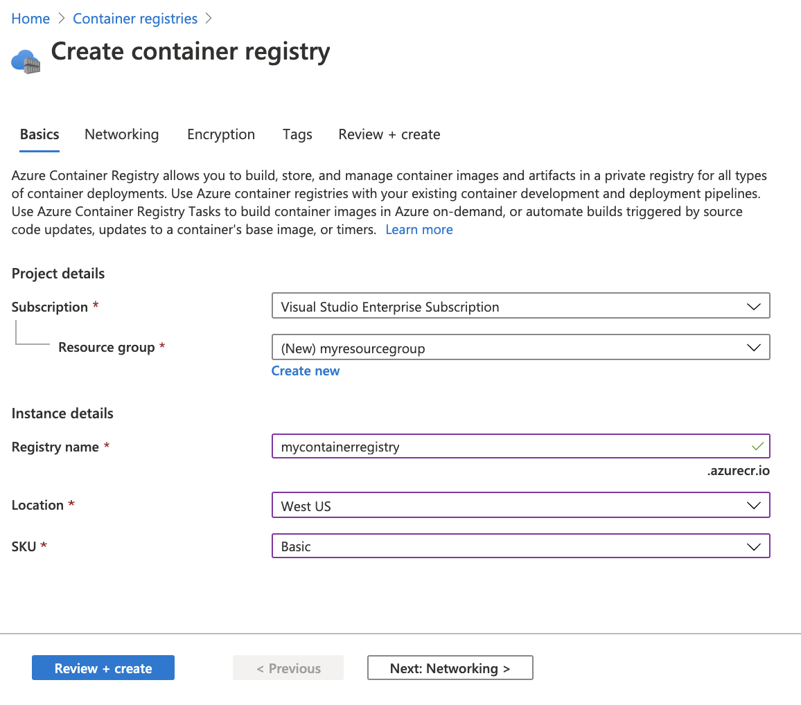
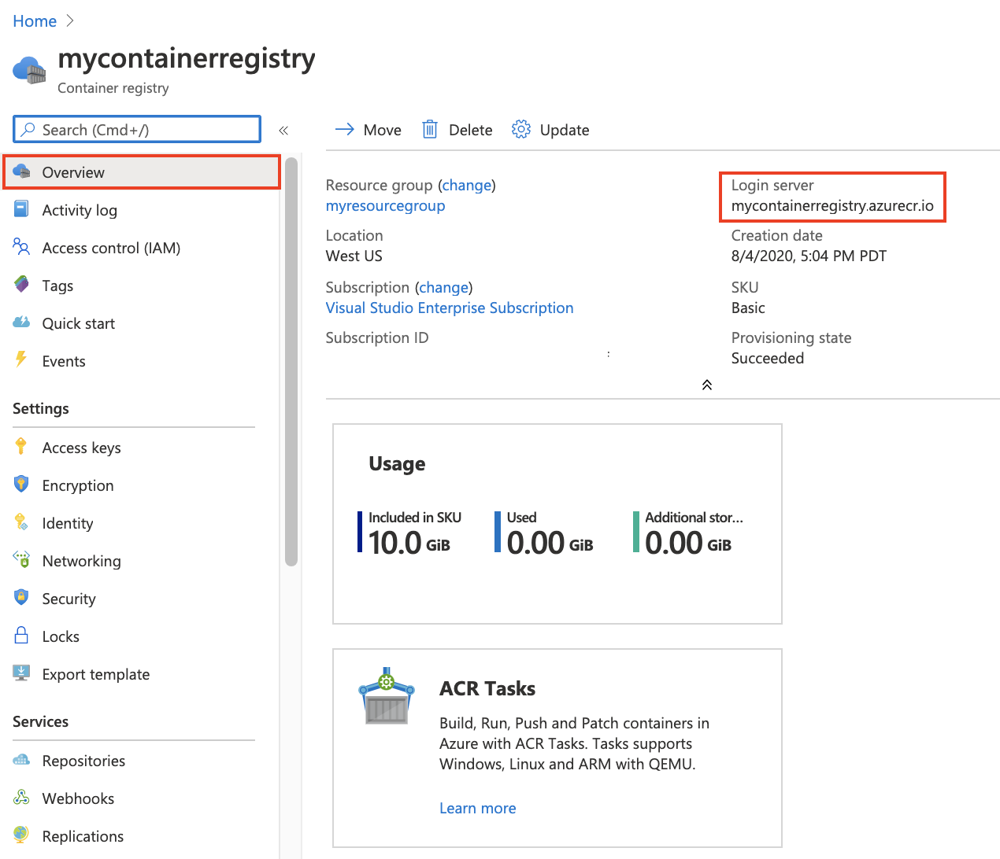

# Azure Container Registry (ACR) Prerequisite

<!-- no toc -->
- [Create the ACR](#create-the-acr)
- [Give the Marketplace access to your ACR](#give-the-marketplace-access-to-your-acr)

## Create the ACR

This exercise walks through creating an Azure Container Registry (ACR) for use in the Container Offers lab.

1. Sign in to the [Azure portal](https://portal.azure.com)
2. Select **Create a resource** > **Containers** > **Container Registry**.

    

3. In the **Basics** tab, enter values for **Resource group** and **Registry name**. The registry name must be unique within Azure, and contain 5-50 alphanumeric characters. 
4. For this lab create a new resource group in the `West US` location named `myResourceGroup`.
5. For **SKU**, select 'Basic'.

    

6. Accept default values for the remaining settings. Select the **Review + create** button at the bottom of the screen. 
7. After reviewing the settings, select **Create**. The deployment of the ACR begins.
8. When the `Deployment succeeded` message appears, click the **Go to resource** button. You will see the ACR as in the image below.

    

9. Take note of the registry name and the value of the **Login server**, which is a fully qualified name ending with `azurecr.io`. You will use these values later.

## Give the Marketplace access to your ACR

The Azure Marketplace will host your CNAB in a Marketplace special ACR of its own. You must grant access to the Microsoft ACR by creating a special service principal in your tenant. The Marketplace will use this service principal to pull your CNAB from your ACR.

> 🗒️ Use the Azure cloud shell in the Azure portal to get a command line on which to run the following commands. Open the cloud shell for PowerShell in the Azure portal by clicking the button indicated below.

1. Run the following commands to add the service principal.

        az ad sp create --id 32597670-3e15-4def-8851-614ff48c1efa

    Note this ID for use in the following steps.

2. Still using the cloud shell, get the ID of your ACR.

        az acr show --name <ACR Server> --query "id" --output tsv

    Note the full ID for the use in the following steps.

3. Create a role assignment to grant the service principal the ability to pull from your registry using the values you obtained earlier.

    > 🗒️ To assign Azure roles, you must have the following.
    >
    > `Microsoft.Authorization/roleAssignments/write` permissions, such as **User Access Administrator** or **Owner**.

    Run the following command.

        az role assignment create --assignee <service-principal-id> --scope <registry-id> --role acrpull

4. The `Microsoft.PartnerCenterIngestion` resource provider must be registered on the same subscription used to create your Azure Container Registry. Use the following command to do the registration.

        az provider register --namespace Microsoft.PartnerCenterIngestion --subscription <your-subscription-id> --wait

    Use the following command to monitor the progress of the provider registration to ensure it completes successfully.

        az provider show -n Microsoft.PartnerCenterIngestion --subscription <your-subscription-id>

**Congratulations!** You now have an Azure Container Registry to use in the labs and perhaps eventually for your production offers.

Go back to the [lab prerequisites](./index.md) and follow on with remaining steps.
