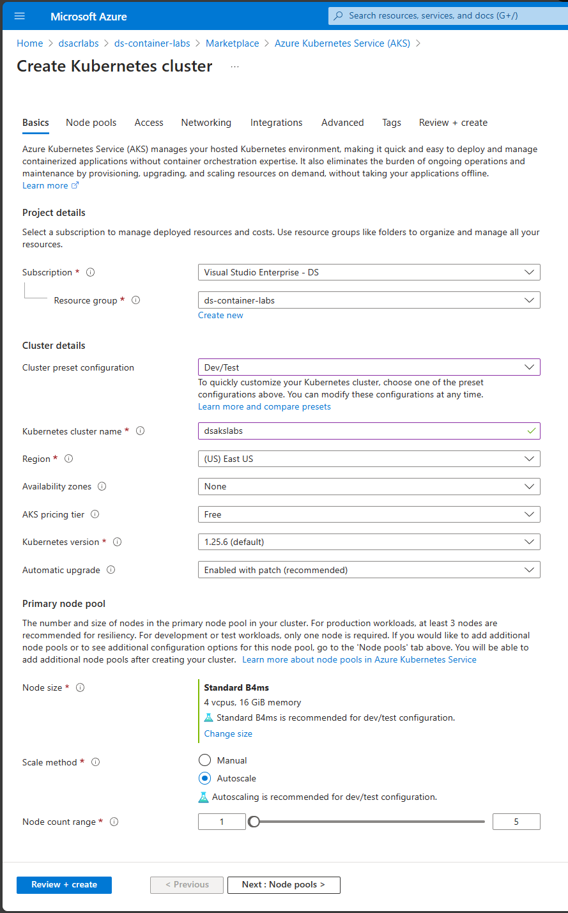

# Create AKS Cluster Prerequisite

This page will walk you through setting up a Azure Kubernetes (AKS) Cluster.

## Create an AKS cluster

1. Sign in to the [Azure portal](https://portal.azure.com).
2. On the Azure portal menu or from the **Home** page, select **Create a resource**.
3. Select **Azure Kubernetes Service**.
4. On the **Basics** tab, configure the following options.
    - **Project details**:
      - Select an Azure **Subscription**.
      - Select or create an Azure **Resource group**, such as *myResourceGroup*.
    - **Cluster details**:
      - Ensure the the **Preset configuration** is *Dev/Test*.
      - Enter a **Kubernetes cluster name**, such as *myAKSCluster*.
      - Select a **Region** for the AKS cluster. Us `US West 3` as it supports the Primary node pool settings you will select next.
      - Leave the default value selected for **Kubernetes version**.
    - **Primary node pool**:
      - Select **Standard B4ms**
      - Enter 1 node for **Node count range** as shown in the below image.

    

5. Click the **Review + create** button at the bottom of the screen.

    > **Note:** When you navigate to the **Review + create** tab, Azure runs validation on the settings that you have chosen.

6. If validation passes, you can proceed to create the AKS cluster by selecting **Create**. If validation fails, then it indicates which settings need to be modified.

    It takes a few minutes to deploy the AKS cluster.

> 🗒️ After your AKS cluster is created, you may stop it to save money on your Azure bill while going through the first set of labs.

**Congratulations!** You now have an AKS Cluster to use in the labs.

Go back to the [lab prerequisites](./index.md) and follow on with remaining steps.
