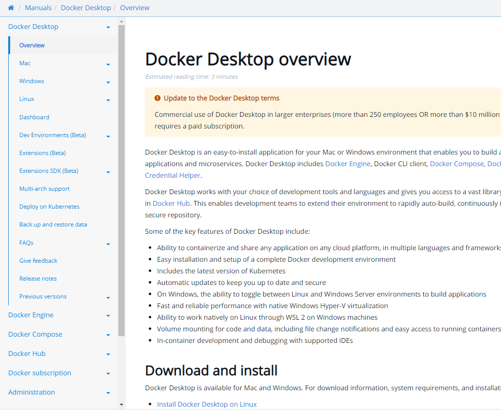

# Install Docker Desktop

Install Docker Desktop locally if you don't already have it.

1. Go to [Download and install](https://docs.docker.com/desktop/#download-and-install).
2. Choose your operating system and follow the instructions

    
